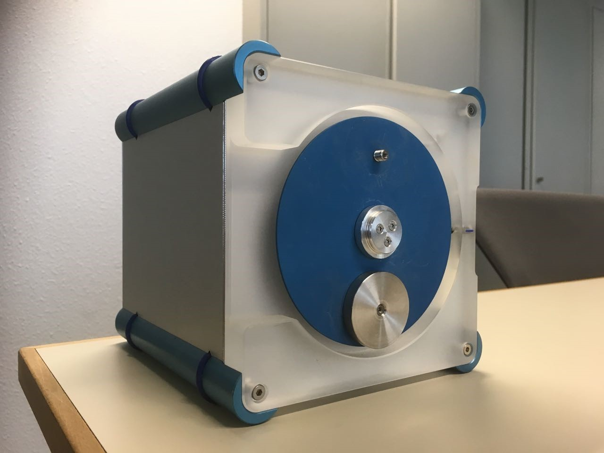

# gym-unbalanced-disk

This is the gym python environment for the unbalanced disk as seen below



This repository includes 
1. **simulators** (Python)
2. **Note** - The New_actor_critic.ipynb is the file containing the code for the soft actor critic model used for training the policy.

Note that the simulator is accurate model of the experimental setup for the provided model parameters. 

## 1.1 Simulator python

### Installation

Use any terminal or equivalent and enter

```
python -m pip install git+https://github.com/GerbenBeintema/gym-unbalanced-disk@master
```

or download the repository and install using

```
git clone https://github.com/GerbenBeintema/gym-unbalanced-disk.git #(or use manual download on the github page)
cd gym-unbalanced-disk
pip install
```

By using git clone you are able to change aspects of the observation space or action space easily.

### Use python simulator

```python
import gymnasium as gym
import gym_unbalanced_disk, time

env = gym.make('unbalanced-disk-v0', dt=0.025, umax=3.) 
#env = gym_unbalanced_disk.UnbalancedDisk(dt=0.025, umax=3.) #alternative

obs, info = env.reset()
try:
    for i in range(200):
        obs, reward, terminated, truncated, info = env.step(env.action_space.sample()) #random action
        print(obs, reward)
        env.render()
        time.sleep(1/24)
        if terminated or truncated:
            obs = env.reset()
finally: #this will always run
    env.close()
```

Lastly, we also provide: 'unbalanced-disk-sincos-v0' or `gym_unbalanced_disk.UnbalancedDisk_sincos` which is the same environment but where angle is now expressed in sine and cosine components.
